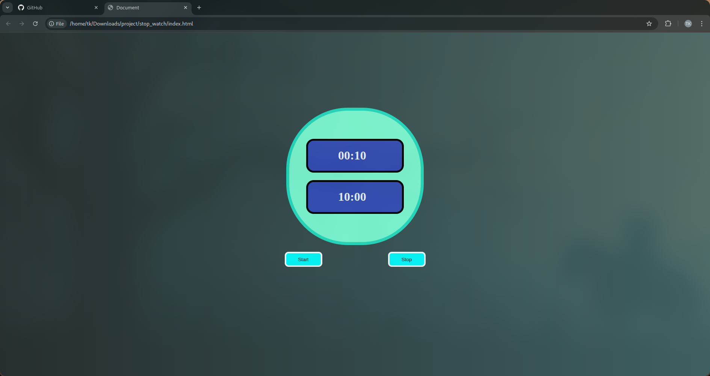
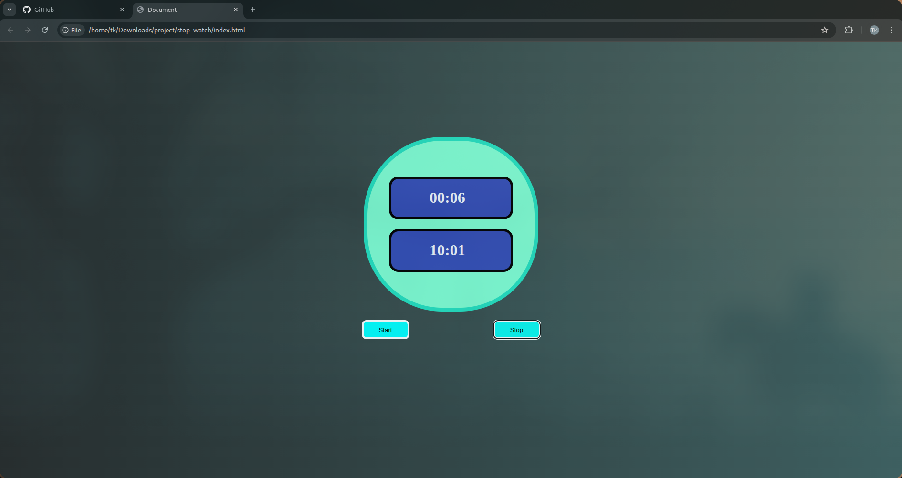

# ⏱️ Stopwatch + Clock Web App

This is a simple web app built using **HTML**, **CSS**, and **JavaScript** that displays:

- A real-time **digital clock**
- A **stopwatch** with Start and Stop functionality
- A blinking animation effect for the stopwatch

---

## 📷 Preview

  
  
  

---

## 🚀 Features

- 🕒 Real-time clock that updates every second
- ⏱️ Stopwatch with start and stop control
- ✨ Smooth blinking animation for the stopwatch
- 🎨 Stylish UI with gradient background and flexible layout

---

## 🛠️ Tech Stack

- **HTML5**
- **CSS3**
- **JavaScript (Vanilla)**

---

## 💻 How to Run

1. Clone the repository:
   ```bash
   git clone https://github.com/yourusername/stopwatch-app.git
   
2. Open the index.html file in your browser:
    ```bash
    cd stopwatch-app
    open index.html
